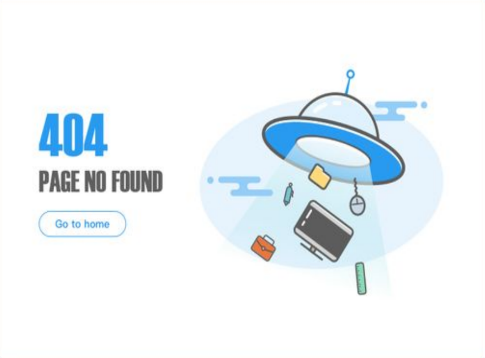

# UFFO

_website project_

This project is for educational purposes only. Pull request are welcome, but priority for project authors! Thank you for your cooperation!

Site published at: https://nuotaikos.github.io/3-uffo-1/  

Design: [UFO](https://cdn.discordapp.com/attachments/850245533838868480/951399092746092554/404-1.png)

## Project features

-   HTML
-   CSS
-   Github pages

## Authors

Diana: [Github](https://github.com/Nuotaikos)
